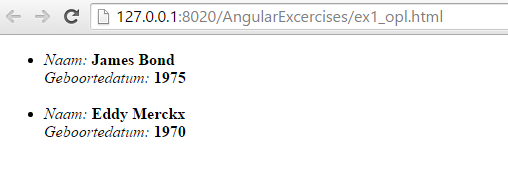
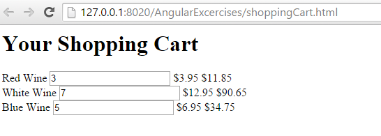
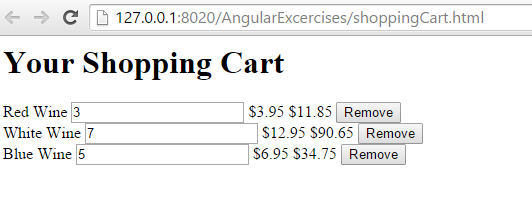

# Oefening 1



Vul verder aan:
```html

<html xmlns="http://www.w3.org/1999/xhtml" xml:lang="en">
	<head>
		<title>ex1</title>
<script>
	myApp = angular.module([]);

	myApp.controller('', ['',
	function() {

		// Let's namespace the user details
		// Also great for DOM visual aids too
		$scope.details = ??

	}]); 
	
	/*
	 * Deze data moet je in de view krijgen
	 */
	{
		'name': "James Bond",
		'dob': '2000'
		}, {
		'name': 'Eddy Merckx',
		'dob': '1970'
	}

		</script>
		</head>

	<body>
		<div>
			<ul>
				<li>
					<em>Naam: </em><strong>{{ }}</strong>
					<br />
					<em>Geboortedatum: </em><strong>{{ }}</strong>
					<br />
					<br />
				</li>
			</ul>
		</div>
	</body>
	</html>
```


# Oefening 2: Shopping Cart - Deel 1

Maak een view en controller met een lijst van producten. Een product bestaat uit een naam
een hoeveelheid, en een prijs. In de view kan je met de ng-repeat directive een lijst van producten uitlezen.
Zorg ervoor dat je in de view een input veld hebt waarbij je de hoeveelheid kan aanpassen. Na aanpassing
wordt automatisch de prijs aangepast.





## Oefening 2: Shopping Cart - Deel 2

Voeg na elk item in de view een button "remove" toe. Na klikken moet het product 
verdwenen zijn.



## Oefening 2: Shopping Cart - Deel 3 - Watch functionality

Voeg extra producten toe die de gebruiker kan selecteren door middel van 
checkboxes. Bekijk : 

* https://docs.angularjs.org/api/ng/input/input%5Bcheckbox%5D
* https://docs.angularjs.org/api/ng/directive/ngChange


 
