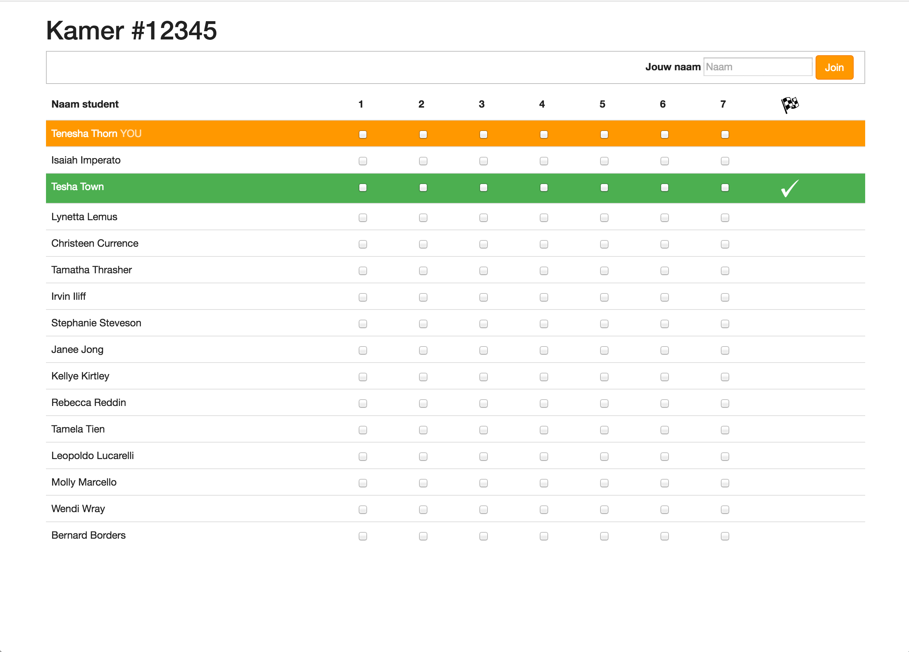
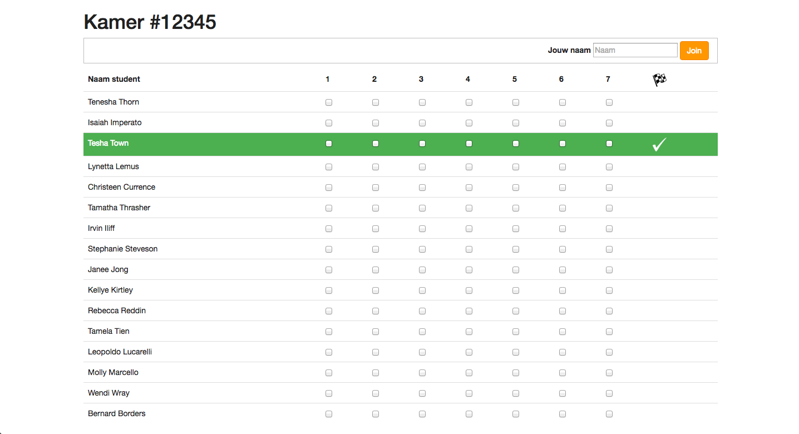
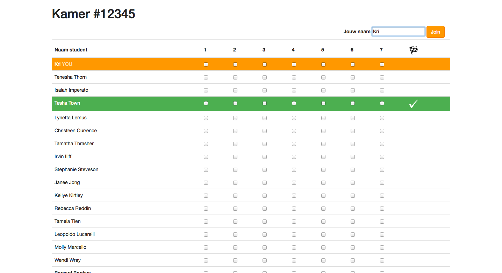
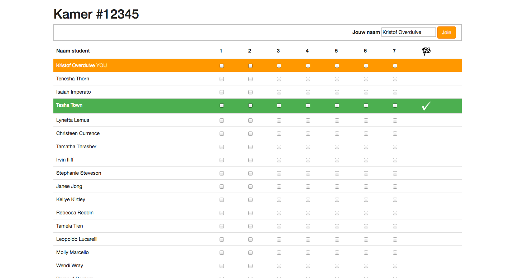
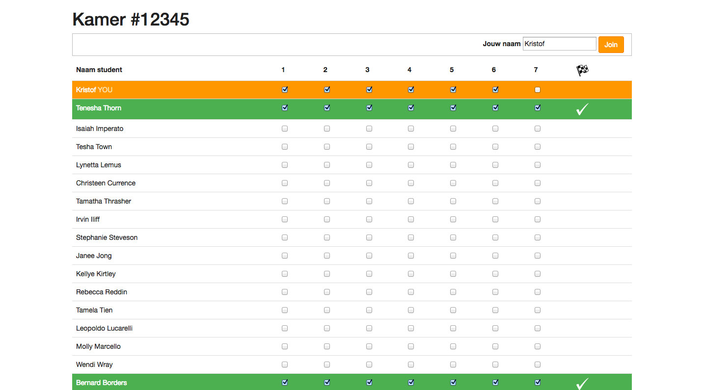
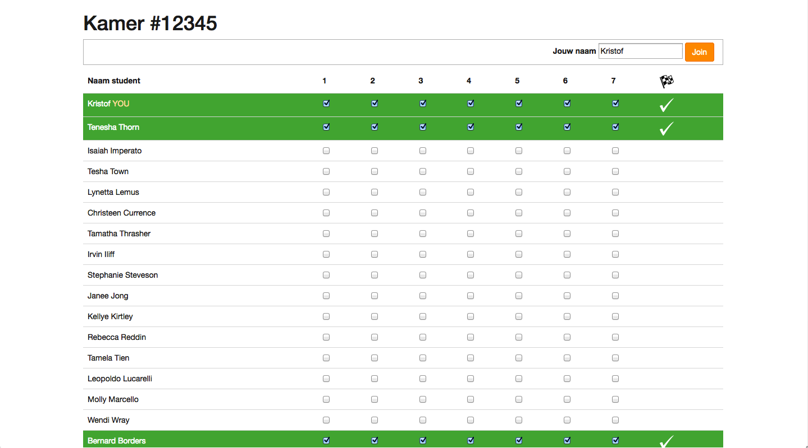

# Project: LabTutor

De bedoeling van dit project is om een applicatie te ontwikkelen gebruik makende van state of the art web frameworks. De applicatie die we zullen ontwikkelen is een web app dat bijhoudt welke studenten met welke oefeningen klaar zijn tijdens een labo. De docent in kwestie maakt een kamer aan voor een bepaald labo en geeft de room ID mee aan de studenten. De studenten openen de relevante kamer en vullen hun naam in. Vervolgens geven ze op de web interface aan met welke oefeningen ze klaar zijn. Als een student klaar is, wordt hij/zij gehighlight op de UI.

Dit project dient als permanente evaluatie en moet elke keer worden ingediend, samen met een uitleg of de implementatie is gelukt en *zo niet* duidelijk aan te geven wat er mis gaat en met welke onderwerpen je moeilijkheden hebt. Je krijgt punten op een correcte werking en/of indien het stuk niet lukte op een constructieve manier aan te geven wat er niet lukte en vervolgens initiatief te nemen om je kennis bij te schaven. De sessie nadien krijg je de model oplossing ter beschikbaar en moet je je eigen code corrigeren met behulp van de modeloplossing. Je zou de model oplossing gewoon kunnen copy pasten, maar daar leer je weinig van.

## Stap 1: CSS

We beginnen het project met een korte recap van de opgedane kennis in voorgaande vakken. Maak zo accuraat mogelijk de onderstaande screenshot na. Het is handig om Bootstrap hiervoor te gebruiken, maar dat moet niet. Gebruik ook enkel de Bootstrap CSS, niet de Javascript. De huidige student wordt getoond en als een student alle oefeningen heeft opgelost wordt dit ook gehighlight met een groene kleur en een vinkje achter. Je mag zelf nadien je project wat mooier maken als je daar zin in hebt.

## Stap 2: data binding

Voeg Angular toe aan je applicatie en creëer je app module. Zorg ervoor dat je je eigen naam kunt invullen in de web interface met double binding. Als er geen naam is ingevuld, wordt de rij met je naam ook niet getoond. Gebruik hiervoor de `ng-show`directive.

Vanaf het moment dat je je naam begint te typen, komt je rij tevoorschijn met de huidige ingevulde waarde.

De rij moet blijven staan wanneer je het invoerveld verlaat.

## Stap 3: controllers

Voeg via controllers de volgende functionaliteit toe. Zet de lijst van studenten met 20 namen in de controller. Werk vervolgens met een ng-repeat om de data van alle studenten te tonen. Wanneer via de UI een vinkje wordt gezet, moet dit in de controller worden opgeslagen. Als alle vinkjes aangevinkt zijn van een bepaalde student, moet zijn rij worden gehighlight.

TODO Extra hulp geven

Het resultaat ziet er dan zo uit.

## Stap 4: services

In plaats van lijst studenten, hun informatie en hun business logica bij te houden in de controller, verplaats deze business logica naar een service met een propere API die je vanuit de controller gebruikt.

## Stap 5: directives

We gaan onze web interface nu uitbreiden om uit meerdere schermen te bestaan. Je kan via de `ng-show` en `ng-hide` directive implementeren. Breid je oplossing uit om toe te laten dat de interface eerst een scherm toont om te vragen of je een docent of student bent. Als je een docent bent, wordt er door een Angular service een room ID aangemaakt en wordt dit bovenaan getoond. Als je een student bent, moet je je naam invoeren, een avatar uploaden en de room ID ingeven waarmee je wilt verbinden (de room ID van de docent).

Voor het uploaden van de avatar, moet je de jQuery.fileupload library verpakken in een mooi herbruikbare Angular directive. Nadat de docent of student de correcte informatie heeft ingevoerd, krijgen ze het scherm met de rijen te zien dat we voordien hebben gemaakt.

Maak ook van de rij van checkboxes een mooie modulaire directive die het gedrag encapsuleert en zo de hoeveelheid duplicate code in de controller beperkt.

## Stap 6: multiple views & routing

Met `ng-show` en `ng-hide` werken is toch wat omslachtig om verschillende views te selecteren. Ook werkt daarmee de back button en dergelijke niet meer. Werk daarom nu met angular-route om de bovenstaande functionaliteit te bekomen. Gebruik de room ID in de route URL.

## Stap 7: filters

?

## Stap 8: Node backend

De applicatie die je hebt ontwikkeld is op zich wel een werkende applicatie, maar de studenten kunnen momenteel noch elkaars resultaten zien, noch kan de lector die van de studenten zien. Dat is omdat alle code op de frontend was geschreven en dus lokaal draaide per laptop. We introduceren daarom een node backend waarin we het server side van onze applicatie zullen ontwikkelen. Studenten moeten hun informatie en oplossingen doorsturen naar de server en krijgen ook te zien wat de andere studenten presteerden.

Gebruik als backend database gewoon een array in memory. We gaan volgende week pas met een echte database werken. Focus je nu op de REST endpoints. Om het idee te geven dat de app real time nieuwe resultaten van studenten weergeeft, poll je best elke 5 seconden voor nieuwe informatie. De server stuurt deze dan terug. Houd er ook rekening mee dat er nu studenten kunnen bij komen en terug weg gaan.

## Stap 9: MongoDB + NoSQL backend

De database zou momenteel verloren gaan als je de server afsluit en opnieuw opstart. Ook is het niet echt performante code. Verander daarom de database op backend naar een MongoDB database.

## Stap 10: Mongoose

Wijzig je voorgaande oplossing om met Mongoose te werken i.p.v. MongoDB rechstreeks aan te spreken.

## Stap 11: WebSockets (optioneel)

Pas aan met websockets ipv polling zodat je een echte realtime web applicatie krijgt.
